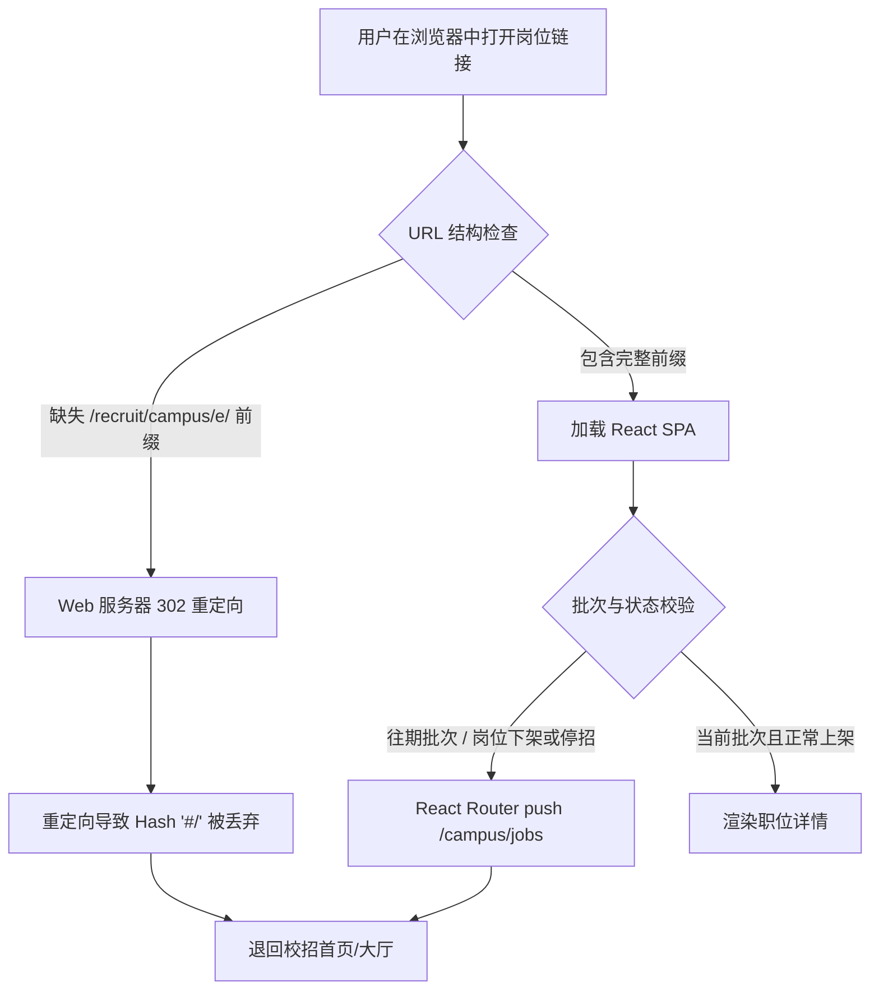

# JobHunt-CLI 招聘岗位 URL 导航与跳转诊断调优报告

> 审计日期：2026-07-19  
> 范围：当前已注册站点的 `jobUrl` / 详情深链  
> 来源：外部逆向诊断报告 + 本仓库实机对照与修复落地

---

## 1. 快手校招岗位链接跳转深层诊断

### 1.1 问题现象

查询到快手校招岗位后，浏览器直开详情链可能在短暂加载后**自动重定向至职位大厅**（`#/campus/jobs`），无法停留在详情页。

### 1.2 技术根因（两重叠加）

#### 根因一：Web 容器基准路径

| 渠道 | 容器路径 | 正确详情 URL 形态 |
|------|----------|-------------------|
| 社招 / 日常实习 | `https://zhaopin.kuaishou.cn/recruit/e/` | `.../recruit/e/#/official/{social\|trainee}/job-info/{id}` |
| 校园招聘 | `https://campus.kuaishou.cn/recruit/campus/e/` | `.../recruit/campus/e/#/campus/job-info/{id}` |

脱离容器路径时 Nginx 可能 302；重定向默认不携带 fragment，Hash 路由丢失。

#### 根因二：SPA 批次校验

校招详情会校验 `recruitSubProjectCode`。示例：

- 当前主推批次：`20271779425607`（应届）、`20271772783534`（实习）
- 往期批次：`20261749721165`（如部分历史岗位）

全新无 Session 环境直开非当前主推批次岗位时，前端可能兜底跳回大厅。CLI 在有数据时附加 `?recruitSubProjectCodes=`；仍失败则属官网生命周期，应用大厅搜索备用入口，而非改用错误社招 URL。

备用大厅：`https://campus.kuaishou.cn/recruit/campus/e/#/campus/jobs`

---

## 2. 全站风险模式与落地状态

| 模式 | 代表站点 | 风险 | 本仓库状态 |
|------|----------|------|------------|
| **A** SPA Hash + 部署基质 | `kuaishou`、`jd` campus、`moonshot`/`deepseek`、`didi` campus | 中：缺容器路径丢 Hash；往期批次 SPA fallback | 快手社招/实习已补 `/recruit/e/`；校招保持 `/recruit/campus/e/` + 批次 query。JD 校招 Hash 可用；JD 社招无稳定深链（列表展开）。Moka 路径可接受 |
| **B** Restful / SSR | `bytedance`、`xiaomi`、`xiaohongshu` | 低 | 无需改 |
| **C** Query 依赖 nature | `meituan`、`ant`、阿里 CPO | 中：缺 `jobType`/`positionType` 可能串渠道 | 美团三类均带 `jobType`；CPO 已带 `positionType`；蚂蚁用路径分流，实机可开 |
| **D** 静态页 / 子域 | `tencent`、`baidu` | 低 | 百度按 `recruitType` 分流；腾讯优先 API `PostURL`（当前校招样本多为海外 Workday） |

---

## 3. CLI / Skill 防呆建议

1. **原样打开** CLI 输出的 `url`，禁止截断 `#` 或 SPA 容器目录。
2. **`detail` 与搜索同 `--nature`**；禁止用社招 URL 冒充校招。
3. **模式 A 历史校招**：直链被踢回大厅时，引导打开官网职位大厅并按岗位名搜索。
4. **数据与 Web 解耦**：CLI 继续走公开 API 取结构化字段；前端跳转不影响 `detail`/`search` 数据完整性。
5. 新增 SPA Hash 站点时，在 adapter 注释写明 SPA root，并在 smoke 抽检详情 URL。

---

## 4. 本次代码改动摘要

- `src/sites/kuaishou/utils.js`：社招/实习 → `/recruit/e/`；校招附带 `recruitSubProjectCodes`；统一 `SOCIAL_SPA_ROOT` / `CAMPUS_SPA_ROOT`。
- `src/sites/meituan/utils.js`：社招详情也带 `jobType=3`。
- `skills/jobhunt-cli/SKILL.md`：URL 打开防呆说明。
